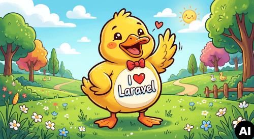

## Laravel PDO DuckDB

A [DuckDB](https://duckdb.org) database driver for [Laravel](https://laravel.com) powered by the DuckDB PDO Driver.

Integrates DuckDB's analytical database engine into Laravel's Eloquent ORM and Schema Builder, enabling fast analytical queries directly from your Laravel application.



### Requirements

- PHP 8.2+
- Laravel 12+
- pdo_duckdb PHP extension

### Install and setup Laravel PDO DuckDB

Install and setup [pdo_duckdb](https://github.com/thomas-0816/pdo-duckdb-php) database driver with [PIE](https://github.com/php/pie):

```bash
pie install thomas-0816/pdo-duckdb-php
```

Install and setup Laravel PDO DuckDB database driver:

```bash
composer require thomas-0816/laravel-pdo-duckdb

php artisan package:discover
```

`pdo_duckdb` is a native DuckDB database driver for the PHP Data Objects (PDO) interface.\
As a native PHP extension, it is implemented in C/C++ and does not require PHP FFI or preloading.\
It is also thread safe and fully tested with FrankenPHP (PHP-ZTS).\
The release packages contain pre-compiled binaries for all supported platforms and DuckDB is directly included.\
DuckDB extensions work the same way as they do in DuckDB CLI.

### Configuration

Add a `duckdb` connection to your `config/database.php`:

```php
'connections' => [
    'duckdb' => [
        'driver'   => 'duckdb',
        'database' => env('DB_DATABASE', database_path('analytics.duckdb')),
        'options' => [
            PDO::DUCKDB_ATTR_CONFIG => [
                'TimeZone' => 'Europe/Berlin',
                // 'access_mode' => 'read_only'
            ]
        ],
    ],
],
```

### In-Memory Database

For testing, use the special in-memory database:

```php
'connections' => [
    'duckdb' => [
        'driver'   => 'duckdb',
        'database' => ':memory:',
        'options' => [
            PDO::DUCKDB_ATTR_CONFIG => ['TimeZone' => 'Europe/Berlin']
        ],
    ],
],
```

## Schema Builder

```php
use Illuminate\Database\Schema\Blueprint;
use Illuminate\Support\Facades\Schema;

// up
Schema::connection('duckdb')->create('events', function (Blueprint $table) {
    $table->id(); // creates sequence "seq_events_id" as auto-increment
    $table->string('category');
    $table->decimal('amount', 12, 2);
    $table->json('tags')->nullable();
    $table->timestamps();
});

// php artisan migrate --pretend
// php artisan migrate

// down
// Schema::connection('duckdb')->createSequence('seq_events_id', 1, 1);
Schema::connection('duckdb')->dropSequence('seq_events_id');
Schema::connection('duckdb')->dropIfExists('events');
```

### Query Builder Insert

```php
use Illuminate\Support\Facades\DB;

DB::connection('duckdb')->table('events')->insert([[
    'category' => 'conference',
    'amount' => 42.21,
    'tags' => ['Hello', 'DuckDB'],
    'created_at' => now(),
    'updated_at' => now(),
]]);
```

### Query Builder Select

```php
use Illuminate\Support\Facades\DB;

$result = DB::connection('duckdb')->query()
    ->selectExpression("date_trunc('week', created_at)", 'week')
    ->selectExpression('sum(amount)', 'revenue')
    ->selectExpression('histogram(tags)', 'tags')
    ->from('events')
    ->groupBy('week')
    ->orderBy('week')
    ->get();

dump($result->toArray());
```

### Eloquent Models

Models can be directly used by specifying the connection "duckdb":

```php
namespace App\Models;

use Illuminate\Database\Eloquent\Model;

class Event extends Model
{
    protected $connection = 'duckdb';
    protected $table = 'events';
}
```

```php
use App\Models\Event;

$event = new Event();
$event->category = 'conference';
$event->amount = 42.21;
$event->tags = ['Hello', 'DuckDB'];
$event->save();
dump($event->toArray());

$events = Event::where('created_at', '>=', now()->subWeek())->get();
dump($events->toArray());
```

### Read CSV files with DuckDB SQL

Query Builder:

```php
use Illuminate\Support\Facades\DB;

$list = [
    ['aaa', 'bbb', 'ccc'],
    ['123', '456', '789'],
    ['ddd', 'eee', 'fff'],
];
$fp = fopen('/tmp/test.csv', 'w');
foreach ($list as $fields) {
    fputcsv($fp, $fields, ',', '"', "");
}
fclose($fp);

$result = DB::connection('duckdb')->query()
    ->select('aaa')
    ->from('/tmp/test.csv') // or multiple files using '/tmp/*.csv'
    ->get();
print_r($result->toArray());

# Array
# (
#     [0] => Array
#         (
#             [aaa] => 123
#         )
#     [1] => Array
#         (
#             [aaa] => ddd
#         )
# )
```

Eloquent models:

```php
namespace App\Models;

use Illuminate\Database\Eloquent\Model;

class TestCsv extends Model
{
    protected $connection = 'duckdb';
    protected $table = '/tmp/test.csv'; // or multiple files using '/tmp/*.csv'
}
```

```php
use App\Models\TestCsv;

$list = [
    ['aaa', 'bbb', 'ccc'],
    ['123', '456', '789'],
];
$fp = fopen('/tmp/test.csv', 'w');
foreach ($list as $fields) {
    fputcsv($fp, $fields, ',', '"', "");
}
fclose($fp);

$rows = TestCsv::select('aaa')->get();
dump($rows->toArray());

# Array
# (
#     [0] => stdClass Object
#         (
#             [aaa] => 123
#         )
#     [1] => stdClass Object
#         (
#             [aaa] => aaa
#         )
# )
```

### Schema Dump

The package supports `schema:dump` Artisan command using DuckDB's `EXPORT DATABASE` SQL statement via PDO:

```bash
php artisan schema:dump --database=duckdb # creates ./database/schema/duckdb-schema.sql
```

### Query Debugging

You can add this line at the beginning of your script for local query debugging:

```bash
\Illuminate\Support\Facades\DB::listen(fn ($query) => dump($query));
```

### Development

Testing:

```bash
composer test
./vendor/bin/pest --coverage
```

### Why DuckDB?

In-Process Architecture: Like SQLite, DuckDB embeds directly into host applications, eliminating the need for a separate server setup.

Extreme Analytical Speed: It uses columnar storage and vectorized (batch) processing, running analytics 10–100x faster than traditional row-oriented databases.

"Larger-than-Memory" Processing: DuckDB gracefully spills data to disk, allowing you to process massive datasets (e.g., 50GB+) on a machine with minimal RAM (e.g., 1GB).

File-Format Agnostic: It can query flat files (JSON, CSV, and Parquet) directly via SQL without needing to import or load the data into a database first.

No Infrastructure Cost: It brings data warehouse-level performance to your local laptop or local server.

DuckDB achieves blazing-fast analytical performance through its embedded, serverless multi-core architecture combined with columnar storage and vectorized execution.
By executing queries directly within the host application, it eliminates serialization and network overhead, processing data in batches (vectors) rather
than row-by-row for unparalleled speed.

https://duckdb.org/why_duckdb

Key Performance Advantages:

Vectorized Query Execution: Unlike row-oriented engines, DuckDB processes data in cache-friendly batches (vectors). This allows modern hardware to operate on
entire arrays of data simultaneously, drastically reducing CPU cycles per query.

Columnar Storage: Data is stored by column rather than by row. For analytical queries that only require a few metrics,
DuckDB only reads the relevant columns from disk/memory, saving massive amounts of I/O.

Zero-Copy In-Process Engine: As an in-process database, DuckDB runs directly in the memory space of your application.

Advanced Query Optimizer: DuckDB features an advanced query optimizer that handles filter pushdowns, unnesting of subqueries, and dynamic runtime filters.
This ensures queries only scan necessary data and avoids full-table sorting when possible.

Direct File Querying: You can query large datasets in open formats like Parquet and CSV directly on disk or in cloud storage (like AWS S3) without needing to import or convert the data first.

### AI Disclosure

The code is written by AI, reviewed and tested without AI.

### License

MIT
